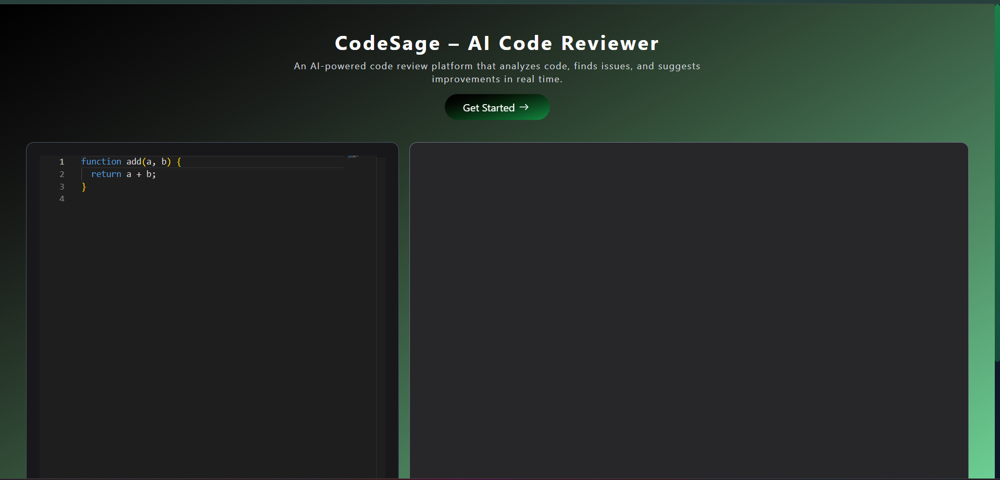
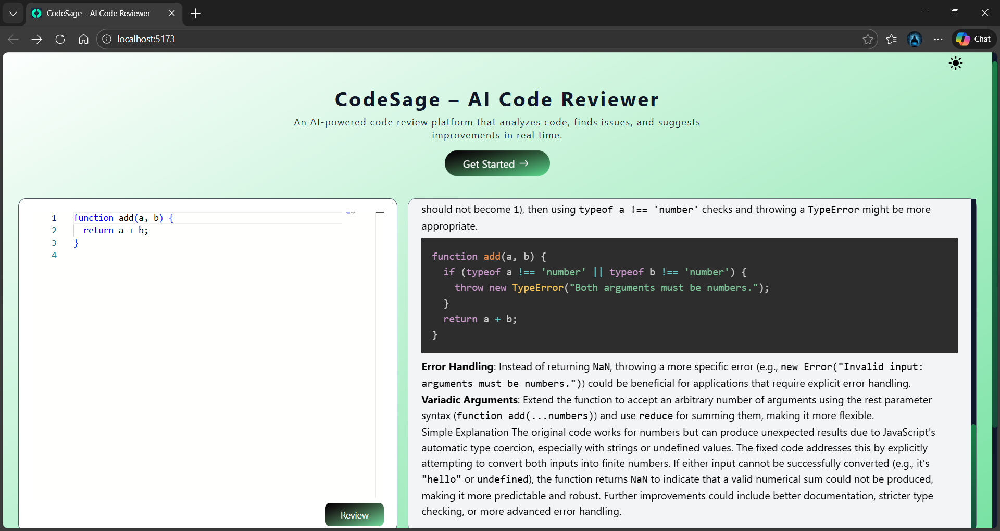

# CodeSage – AI Code Reviewer 🚀

CodeSage is an AI-powered code review web application that allows users to submit code and receive instant reviews, suggestions, and improvements with a clean VS Code–like interface.

---

## 📸 Screenshots

### 🏠 Home Page


### 🤖 AI Code Review Output
.png)

### 🤖 AI Code Review Output
.png)

### 🤖 AI Code Review Output
.png)

### 🤖 Dark mode / Light mode



## ✨ Features

- 🧠 AI-powered code review using Google Gemini
- 🧩 Supports reviewing code snippets (JavaScript and more)
- 🎨 VS Code–like editor using Monaco Editor
- 🌈 Syntax-highlighted output with Markdown support
- 📱 Fully responsive design (mobile & desktop)
- ⏳ Graceful handling of API quota limits
- 🔐 Secure backend with environment variables

---

## 🛠 Tech Stack

### Frontend
- React (Vite)
- Tailwind CSS
- Monaco Editor
- Prism Js
- React Markdown

### Backend
- Node.js
- Express.js
- MongoDB (Mongoose)
- Google Gemini API

### Deployment
- Frontend: Vercel
- Backend: Render
- Database: MongoDB Atlas

---

## 📂 Project Structure

```txt
CodeSage
├── client   # Frontend (React + Vite)
└── server   # Backend (Node + Express)

```
### ▶️ Run Locally

### Backend
```text
cd server
npm install
npm start

```
### Frontend

```text
cd client
npm install
npm run dev
```

### 🌐 Deployment Notes 

- Backend deployed on Render
- Frontend deployed on Vercel
- Environment variables are configured in the respective dashboards
- Free-tier Gemini API has daily request limits

---
### 🧠 How It Works

- User writes code in the editor
- Code is sent to the backend API
- Gemini AI reviews the code
- Response is returned and displayed with syntax highlighting

---

### 📌 Future Improvements

- Language auto-detection
- Multiple language support
- Diff view (before vs after)
- Authentication & user history
- Streaming AI response

---

### 👨‍💻 Author

### Rahul Kumar

- GitHub: https://github.com/ahulkumar1234
- LinkedIn: https://www.linkedin.com/in/rahul-kumar-3990b618b

----
### 📄 License

### This project is for learning and demonstration purposes.
